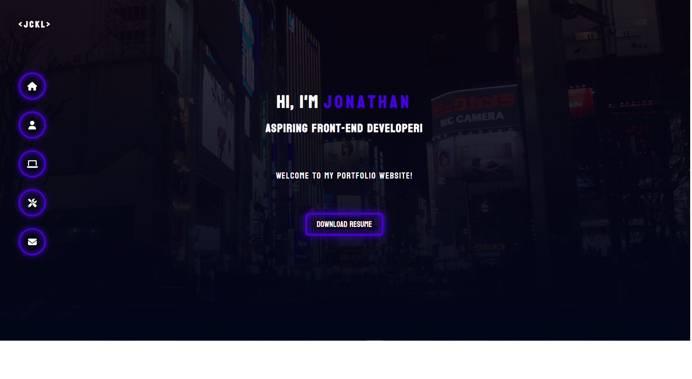

<h2 align="center">
  Portfolio Website 
  <a href="https://jckl.xyz" target="_blank">jckl.xyz</a>
</h2>

    
    
    

  

# Summary

My personal portfolio which showcases my github projects that I have created during my web development journey, as well as my resume and technical skills. 

## Built With

This project was built using these technologies.

-  [React](https://reactjs.org/)
-  [SASS](https://sass-lang.com/)
-  [FontAwesome](https://fontawesome.com/v5.15/icons?d=gallery&p=1) for the icons
-  [Porkbun](https://porkbun.com/) for the domain
-  [Netlify](https://www.netlify.com/) for hosting
-  [Figma](https://www.figma.com/) for designing

---

## Creator / Maintainer

Jonathan Lee ([jonathancklee](https://github.com/jonathancklee1))

---

### License

Copyright &copy; 2022 Jonathan Lee. All rights reserved.
